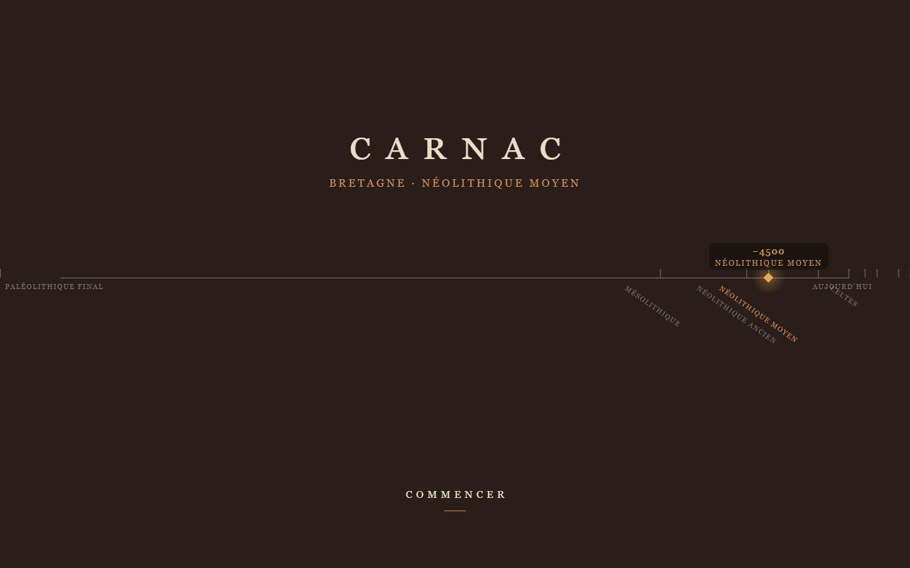
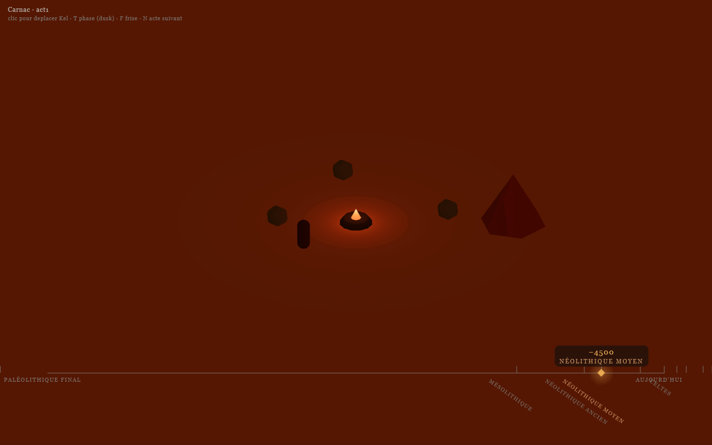
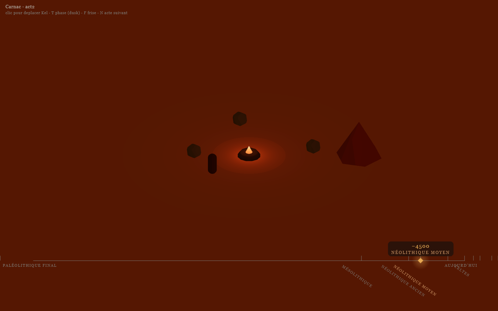
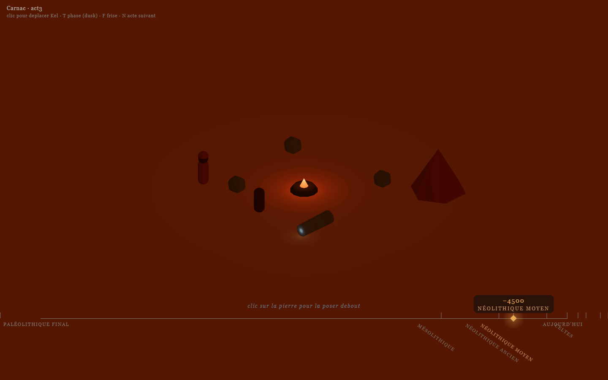
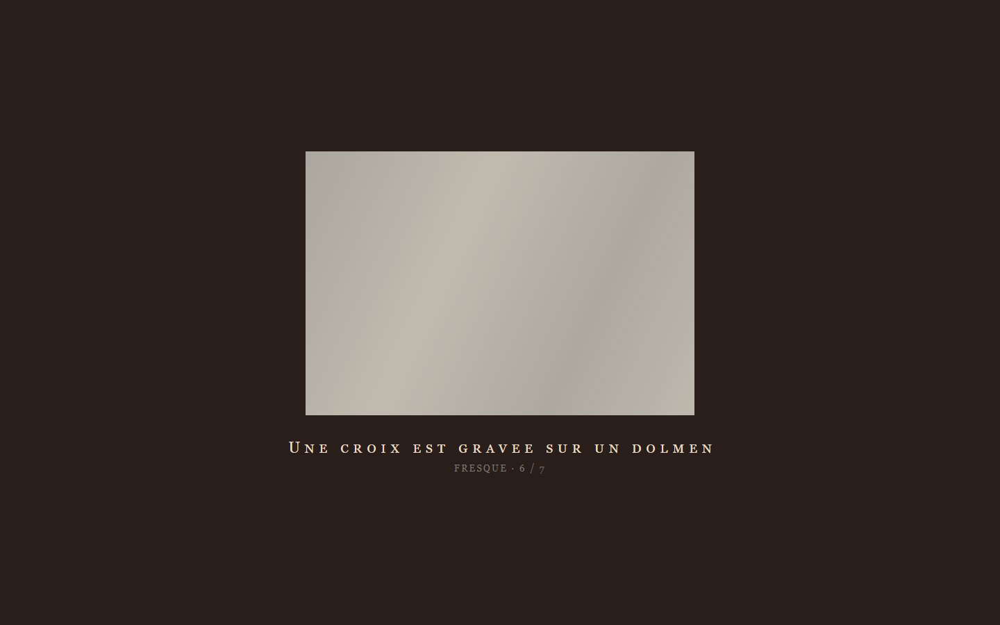
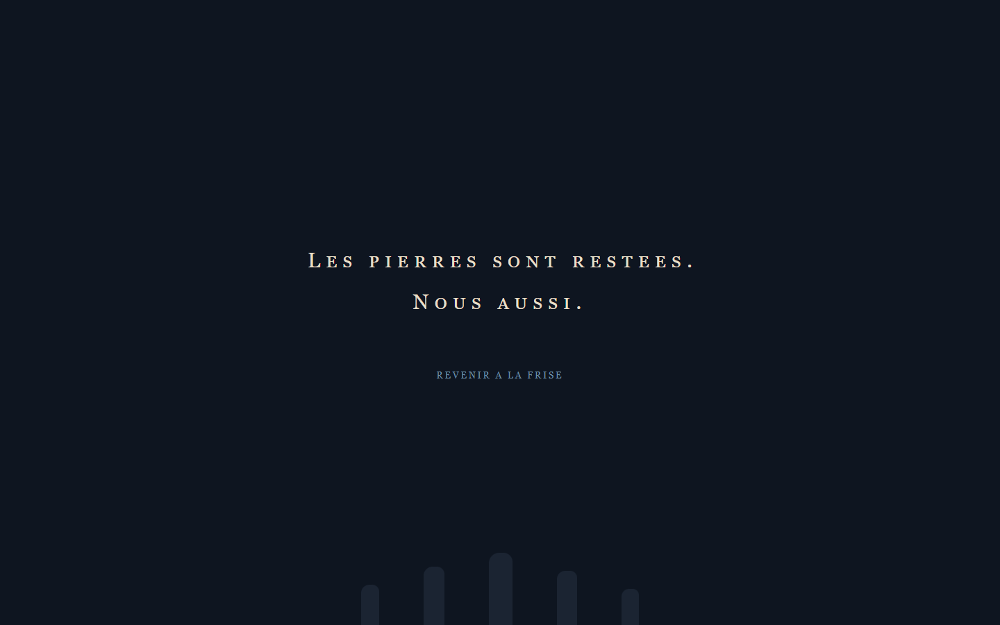
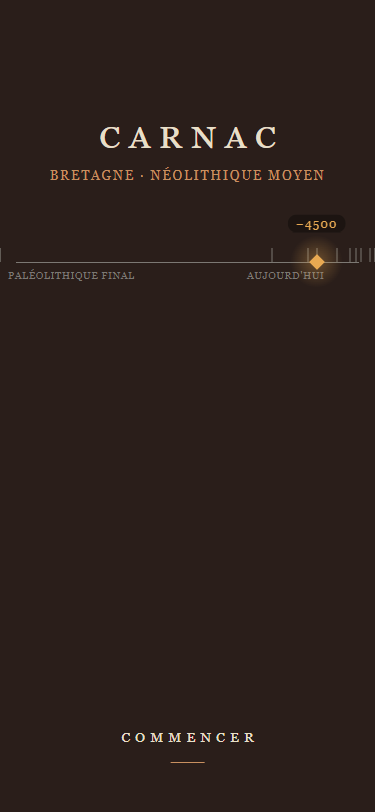
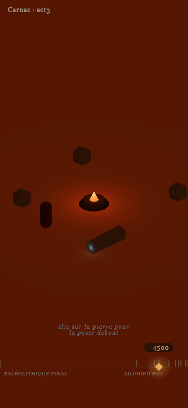
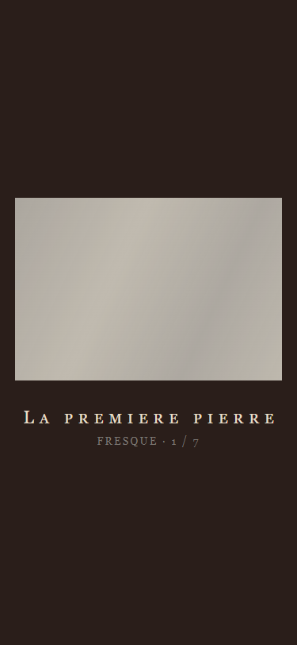

# Carnac

> Un jeu-poème pédagogique sur la naissance du rite mégalithique dans la Bretagne du Néolithique moyen (~4500 av. J.-C.). On y suit une tribu au moment où la première pierre est mise debout, puis on regarde les millénaires passer.



<p align="center">
  
  
  
  
  
  
</p>

## En deux minutes

*Carnac* n'est pas un jeu de survie préhistorique. C'est un **jeu-poème court** (~20 à 30 minutes) qui pose une question : pourquoi des humains sans écriture ni métal ont commencé, il y a près de sept mille ans, à dresser des pierres. La joueuse incarne Kel, jeune femme du Néolithique moyen armoricain, dans les trois moments qui précèdent le premier geste rituel : le quotidien, la rencontre, le deuil. Elle pose la première pierre. Puis les millénaires passent, en sept vignettes pariétales animées, jusqu'à aujourd'hui.

Le jeu s'adresse aussi bien aux joueurs adultes qu'aux enfants. Il rappelle une évidence oubliée : ces humains, c'est nous.

## Aperçus

### Écran-titre et frise du temps profond


### Acte 1 · Quotidien de la tribu (scène 3D isométrique)


### Interlude · une phrase, une couleur


### Acte 3 · Le premier geste


### Épilogue · sept vignettes pariétales animées


### Écran final


### Mobile 375 · même expérience, layout adapté
<p>
  
  
  
</p>

## Ce que le jeu propose déjà (état actuel, jouable end-to-end)

- Écran-titre avec **frise du temps profond** interactive, curseur posé sur -4500 av. J.-C.
- Trois actes narratifs + deux interludes contemplatifs
- Scène 3D isométrique orthographique cel-shadée (three.js + react-three-fiber)
- **Climax jouable in-world** : cliquer la pierre couchée pour la lever, particules dorées, caméra dolly vers le geste, PNJ Vann qui approche et pose une deuxième pierre, tribu (Nia + un ancien) qui apparaît en fondu
- **Épilogue en séquence** : sept vignettes pariétales dessinées trait par trait (stroke-dashoffset animé), curseur de la frise qui glisse de -4500 à 2026, traversant l'Alignement, l'Âge du Bronze, l'arrivée des Celtes, Rome, la christianisation des dolmens, jusqu'à aujourd'hui
- Écran final sobre : « Les pierres sont restées. Nous aussi. »
- Responsive desktop et mobile (audités au 1440×900 et 375×812)

## Cadre historique

Le jeu se déroule dans la **lande morbihannaise du Néolithique moyen armoricain**, environ 4500 av. J.-C., à l'époque des cultures Cerny et Chasséen. Les personnages sont des populations **anonymes, pré-celtes de 3000 ans**, sans écriture, sans métal. Les Celtes n'arriveront en Bretagne que bien plus tard, à l'Âge du Fer.

Choix historiques assumés, tous documentés dans [`docs/notes-historiques.md`](docs/notes-historiques.md) :

- Peuple néolithique moyen armoricain, **pas Celte**
- Culture matérielle conforme à l'archéologie (silex, os, bois, poterie, torchis)
- **Palette humaine mate à foncée**, cheveux foncés, éventail d'yeux. Choix scientifique fondé sur l'archéogénétique récente (Cheddar Man, Reich Lab, Mathieson 2015, Brace 2018)
- Langue inventée non traduite (style *Journey*, *Ico*), aucune ambition de reconstitution linguistique
- Thèse retenue pour l'origine du geste mégalithique : **culte des ancêtres et marqueur territorial** (Colin Renfrew, 1976), avec touche cosmologique en second plan

## Architecture narrative « A+ »

Un moment fondateur autonome (le MVP) enveloppé d'un cadre méta-temporel qui situe le joueur dans le temps profond.

```
Ecran-titre : frise du temps profond, curseur sur -4500 av. J.-C.
     ↓
Acte 1 : Quotidien de la tribu (feu, chasse, cueillette)
     ↓  [interlude · "Un jour, comme les autres."]
Acte 2 : Rencontre inter-tribu + deuil d'un membre aimé
     ↓  [interlude · "L'étoile, encore."]
Acte 3 : Climax · la joueuse pose la première pierre
     ↓
Épilogue : ellipse jusqu'à aujourd'hui, sept vignettes pariétales
     ↓
Écran final : "Les pierres sont restées. Nous aussi."
```

Détail : [`docs/specs-mvp.md`](docs/specs-mvp.md) · [`docs/storyboard-actes.md`](docs/storyboard-actes.md) · [`docs/roadmap.md`](docs/roadmap.md).

## Stack technique

| Couche | Choix |
|--------|-------|
| Bundler / dev server | **Vite 6** |
| Framework UI | **React 18** + TypeScript 5 strict |
| Rendu 3D | **three.js r170** via `@react-three/fiber` v8 + `@react-three/drei` v9 |
| Style visuel | Cel-shading maison (`meshToonMaterial` + gradient discret) + outlines drei |
| Design system | Tokens centralisés (`src/palette.ts`, `src/design/tokens.css`, `src/design/outlines.ts`) |
| Tests | **Vitest 3** + `@testing-library/react` + jsdom · **93 tests verts** |
| Style narratif | Machine à états pure + hook React, guards de progression conditionnelle |

Aucun asset 3D acheté ou téléchargé. Les personnages et objets sont pour l'instant des **primitives r3f** (capsule, cylindre, cône, sphère) qui exhibent la couche technique. Un pipeline de génération 3D par IA (Hunyuan local) est prévu pour la production réelle des assets ; voir [`docs/direction-artistique.md`](docs/direction-artistique.md) section 13.

## Démarrage rapide

Prérequis : Node 20 ou supérieur (testé sur Node 23).

```bash
git clone https://github.com/smaurier/carnac.git
cd carnac
npm install
npm run dev
```

Ouvre `http://localhost:5173` (ou `5174` / `5175` si le port est pris).

### Contrôles

| Touche / geste | Effet |
|----------------|-------|
| Clic sur le sol | Kel se déplace vers le point cliqué |
| `T` | Cycle la phase du jour (dawn → noon → dusk → night) |
| `F` | Masque / affiche la frise |
| `N` | Passe à l'acte suivant (bloqué en Acte 3 tant que la pierre n'est pas posée) |
| Clic sur la pierre (Acte 3) | Pose la pierre debout, déclenche le climax |

### Scripts npm

- `npm run dev` · serveur de développement (hot reload)
- `npm run build` · build de production dans `dist/`
- `npm run preview` · sert le build de production
- `npm run typecheck` · vérification TypeScript stricte
- `npm test` · exécute la suite Vitest
- `npm run test:watch` · Vitest en mode watch

## Structure du repo

```
carnac/
├── README.md · ce fichier
├── CLAUDE.md · guidelines de dev (conventions, TDD, design system)
├── package.json · Vite + React + TS + r3f + Vitest
├── vite.config.ts · Vite + Vitest
├── index.html
├── docs/
│   ├── notes-historiques.md      cadre archéo, thèses, sources
│   ├── specs-mvp.md              specs du premier chapitre jouable
│   ├── direction-artistique.md   charte graphique complète
│   ├── moodboard.md              références visuelles fiables
│   ├── roadmap.md                vision longue et extensions
│   ├── storyboard-actes.md       scène par scène des 3 actes
│   ├── assets/screenshots/       captures pour ce README
│   └── mockups/                  SVG mockup scène 3D + UI Claude Design
└── src/
    ├── main.tsx · entrée React
    ├── App.tsx · orchestrateur composé
    ├── palette.ts · palette + presets jour/nuit
    ├── styles.css · reset + overlays
    ├── setup-tests.ts · setup Vitest + testing-library
    ├── design/                   tokens (couleurs, spacing, typo, outlines)
    ├── shaders/toon-gradient.ts  cel-shading singleton
    ├── narrative/                state machine + guards + hook
    ├── scene/                    IsoCamera dolly, DayNightCycle, Ground
    ├── entities/                 Player, Firepit, StandingStone, Villager,
    │                             RitualCompanion, TribeWitnesses, StoneEmbers
    └── ui/
        ├── timeline/             frise + modèle testé
        ├── title/                TitleScreen
        ├── interlude/            Interlude
        ├── fresque/              Fresque (8 variantes dessinées)
        ├── epilogue/             EpilogueSequence (7 vignettes)
        └── end/                  EndScreen
```

## Qualité et discipline

- **TDD strict** sur toute la logique métier : machine à états narrative, guards, timeline model, epilogue sequence, toon gradient
- **93 tests Vitest** passant, typecheck strict activé, build propre
- **Design system** avec tokens centralisés (couleurs, spacing, typo, radii, transitions, outlines, z-index)
- **Vérification visuelle Playwright** systématique desktop 1440 + mobile 375 avant chaque commit UI (voir `CLAUDE.md`)

## Roadmap

- **Phase 1 · MVP end-to-end en placeholders** ✅ *(état actuel)* : jouable de bout en bout, chaque brique testée
- **Phase 2 · Vrai contenu Acte 1 et 2** : interactions selon le storyboard (Athro qui taille le silex, Vann qui rapporte des coquillages, Nia qui court après la chèvre, rencontre inter-tribu, mort d'Athro)
- **Phase 3 · Vrais assets 3D** : personnages générés par IA (Hunyuan local), habitats en torchis, végétation lande morbihannaise, mer d'ardoise
- **Phase 4 · Son** : drone minéral, corne lointaine, chœur féminin au climax, vocalises PNJ en langue inventée
- **Phase 5 · Playtests + polish**
- **Phase 6 · Publication** : itch.io, GitHub Pages, éventuellement version pédagogique pour un musée régional (Musée de Préhistoire de Carnac cible naturelle)

Vision longue : voir [`docs/roadmap.md`](docs/roadmap.md).

## Contribuer

Toute correction historique sourcée est bienvenue par issue GitHub. Le projet est ouvert aux relectures d'archéologues, historiens du mégalithisme européen, spécialistes de l'archéogénétique néolithique.

Pour les contributions techniques :

1. Lire [`CLAUDE.md`](CLAUDE.md) qui fixe les conventions (TDD, SOLID, design tokens, vérification Playwright).
2. Ouvrir une issue avant de démarrer un chantier non trivial.
3. Un PR = un sujet, tests verts, typecheck propre, screenshots avant/après si UI touchée.

## Licence

À définir. Contactez le mainteneur pour tout usage commercial ou muséographique.

## Remerciements

- **Colin Renfrew** pour la thèse territoriale du mégalithisme
- **Reich Lab (Harvard)** pour les données d'archéogénétique
- **Natural History Museum Londres** pour la reconstitution du Cheddar Man
- **Thatgamecompany**, **Shedworks**, **Cardboard Computer** pour les références esthétiques (*Journey*, *Sable*, *Kentucky Route Zero*)
- Les bâtisseurs anonymes du Néolithique moyen armoricain

---

<p align="center">
  <em>Les pierres sont restées. Nous aussi.</em>
</p>
